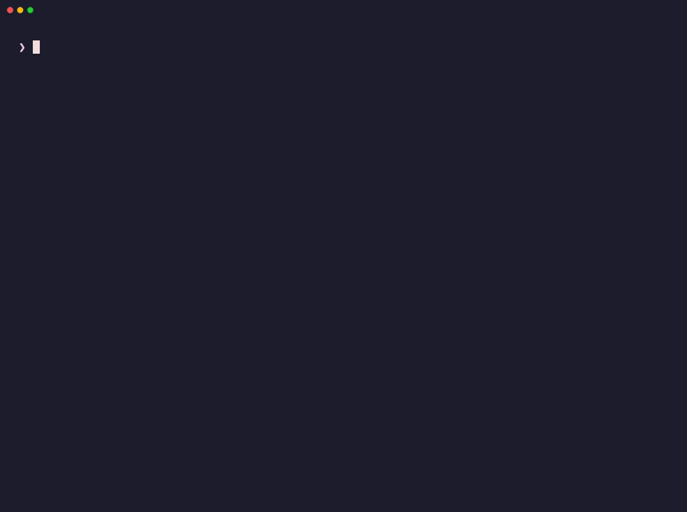
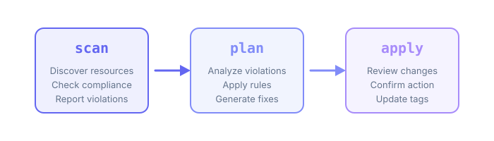

<p align="center">
  <a href="https://tagctl.dev">
    <picture>
      <source media="(prefers-color-scheme: dark)" srcset="docs/logo/dark.svg">
      
    </picture>
  </a>
</p>

<h3 align="center">Audit, fix and enforce cloud resource tags</h3>

<p align="center">
  Scan what is wrong, review the plan, then apply it.<br>
  106 AWS resource types, every region by default, and Kubernetes labels.
</p>

<p align="center">
  <a href="https://tagctl.dev"><b>Website</b></a>
  &nbsp;·&nbsp;
  <a href="docs/getting-started.mdx"><b>Getting started</b></a>
  &nbsp;·&nbsp;
  <a href="docs/commands.mdx"><b>Commands</b></a>
  &nbsp;·&nbsp;
  <a href="docs/configuration.mdx"><b>Configuration</b></a>
  &nbsp;·&nbsp;
  <a href="https://github.com/unicrons/tagctl/releases"><b>Releases</b></a>
</p>

<p align="center">
  <a href="https://github.com/unicrons/tagctl/actions/workflows/ci.yml"></a>
  <a href="https://codecov.io/gh/unicrons/tagctl"></a>
  <a href="https://goreportcard.com/report/github.com/unicrons/tagctl"></a>
  <a href="https://github.com/unicrons/tagctl/releases"></a>
  <a href="LICENSE"></a>
</p>

<br>

<p align="center">
  
</p>

## Why tagctl?

Untagged resources are a FinOps blind spot: you cannot allocate the cost,
find the owner or prove compliance. The usual answers are either heavy
(Cloud Custodian), passive (AWS Tag Policies) or billed per rule (AWS Config).

tagctl is one binary and three commands:

```bash
tagctl scan    # What is wrong?    → output/scan-<ts>.{json,csv,html}
tagctl plan    # How to fix it?    → output/plan-<ts>.json
tagctl apply   # Fix it.           → tags written after a confirmation prompt
```

<p align="center">
  <picture>
    <source media="(prefers-color-scheme: dark)" srcset="docs/images/workflow-dark.svg">
    
  </picture>
</p>

## Features

| | |
|---|---|
| **Wide coverage** | 106 AWS resource types, the same services Prowler audits, from EC2 and S3 to GuardDuty, WAF, Bedrock and IAM roles. Every region unless you say otherwise. See [the full list](docs/providers/aws.mdx). |
| **Kubernetes too** | Pods, deployments, services, namespaces and config maps, with labels as the tags. See [the provider page](docs/providers/kubernetes.mdx) for what label values cannot hold. |
| **Fixes, not just findings** | Infer tags from resource names (`web-prod-api` → `environment: prod`), fill gaps with conditional defaults, preview with `plan`, write with `apply`. |
| **CI native** | SARIF for GitHub code scanning, JUnit for any CI, compliance gates (`--fail-under`, `--fail-on-new`) that exit `1` on a policy failure and `2` on any other error, and `diff` to report what got worse since a baseline. |
| **Shift left** | `terraform` checks a plan or state against the policy before anything is created, honouring `default_tags`. |
| **FinOps signals** | `cost` puts a currency figure on the spend your tags fail to attribute; `normalize` catches `prod` / `Production` / `PROD` before it splits a cost report. |
| **OCSF** | Every finding as an OCSF 1.4 Compliance Finding, ready for Security Lake or any OCSF-native SIEM. |
| **Reports** | JSON for pipelines, CSV for spreadsheets, and a standalone HTML report that opens offline. |
| **Safe by default** | Read-only until `apply`; credentials never live in the config file. |

## Quick start

```bash
go install github.com/unicrons/tagctl/cmd/tagctl@latest

tagctl init        # scaffolds tagctl.yaml
tagctl scan        # audits the account and writes the reports
tagctl plan        # proposes the tags to add
tagctl apply       # writes them, after you confirm
```

`go install` needs Go 1.26.6 or later, the version `go.mod` requires.
Pre-built binaries for Linux, macOS and Windows (amd64 and arm64) are attached
to every [release](https://github.com/unicrons/tagctl/releases) with a
`checksums.txt`.

## Configuration

`tagctl.yaml` declares the accounts to scan, the policy, the fix rules and
what to ignore. Credentials come from the AWS SDK chain (profiles, SSO,
instance roles); they are never written here.

```yaml
clouds:
  aws:
    - profile: production
    - profile: staging
      regions: [us-east-1]

policy:
  required:
    - name: environment
      values: [dev, staging, prod]
    - name: cost-center
      pattern: "^[A-Z]{2,4}-\\d{3,6}$"
    - name: owner
      pattern: "^.+@company\\.com$"

rules:
  infer:
    - tag: environment
      from_name:
        - pattern: "-prod-"
          value: prod
  defaults:
    - resource: "*"
      when:
        tag:owner: absent
      set:
        owner: platform-team@company.com

ignore:
  resources:
    - "aws_cloudwatch_*"
```

The [configuration reference](docs/configuration.mdx) covers every field,
[credentials](docs/credentials.mdx) the auth options (AssumeRole, external
id, MFA) and [rules](docs/rules.mdx) the inference and defaults engine.

## Permissions

Two IAM roles, shipped as CloudFormation templates in [`permissions/aws/`](permissions/aws):

| | |
|---|---|
| `TagctlScan` | Read-only. Runs `scan`, `plan`, `diff`, `normalize`, `terraform` and `cost`. The one for CI and schedules. |
| `TagctlApply` | The scan policy plus the tag write actions, each scoped to the resource types tagctl tags (CodeBuild is opt-in). Only `apply` needs it; trust it to people, behind MFA or an external id. |

```bash
aws cloudformation deploy \
  --template-file permissions/aws/tagctl-scan-role.yaml \
  --stack-name tagctl-scan-role \
  --capabilities CAPABILITY_NAMED_IAM \
  --parameter-overrides TrustedPrincipalArn=arn:aws:iam::123456789012:role/platform-admin
```

`TrustedPrincipalArn` is the principal of the role's trust policy. Name the
role or user that runs tagctl. An account root ARN
(`arn:aws:iam::123456789012:root`) is accepted too, but it trusts every
principal in that account whose own policies allow `sts:AssumeRole` on this
role, not one identity. The `OrgId` parameter adds an `aws:PrincipalOrgID`
condition on top; see [`permissions/aws/`](permissions/aws#who-can-assume-the-role).

## Example output

```
━━━━━━━━━━━━━━━━━━━━━━━━━━━━━━━━━━━━━━━━━━━━━━━━━━━━━━━━━━━
                  Tag Compliance Report
━━━━━━━━━━━━━━━━━━━━━━━━━━━━━━━━━━━━━━━━━━━━━━━━━━━━━━━━━━━

Overall: 65% compliant █████████████░░░░░░░ (98/150 resources)

By Account:
  ACCOUNT         TOTAL  COMPLIANT  COMPLIANCE
  aws/production  100    85         85% ████████░░
  aws/staging     50     13         26% ██░░░░░░░░

By Required Tag:
  TAG          PRESENT  MISSING  INVALID  COMPLIANCE
  environment  140      10       0        93% █████████░
  cost-center  98       52       5        62% ██████░░░░
  owner        75       75       10       43% ████░░░░░░

Run 'tagctl plan' to see suggested fixes.
```

```
Planned changes:

aws_instance (web-prod-api-1)
  + environment:  "prod"                       (inferred: name contains '-prod-')

aws_s3_bucket (legacy-data-2019)
  + owner:        "platform-team@company.com"  (default)

Summary: 3 resources will be modified, 5 tags will be added
Run 'tagctl apply' to execute this plan.
```

## Commands

| Command | What it does |
|---------|--------------|
| `tagctl init` | Scaffold a `tagctl.yaml` |
| `tagctl validate` | Validate the configuration |
| `tagctl scan` | Audit resources and write `scan-*.{json,csv,html}` |
| `tagctl plan` | Turn the latest scan into a remediation plan |
| `tagctl apply` | Apply the latest plan |
| `tagctl diff` | Compliance drift between two scans |
| `tagctl normalize` | Tag values that are variants of one another |
| `tagctl terraform` | Check a Terraform plan or state before apply |
| `tagctl cost` | Spend your tags fail to account for |
| `tagctl evaluate` | Evaluate resources from external JSON (Prowler integration) |

Each command feeds the next through `output/` (`--output-dir` names another
directory); `--scan` and `--plan` pick a specific file instead of the latest. Flags, exit codes and CI gates are in the
[command reference](docs/commands.mdx).

## Use in CI

The repository is also a GitHub Action. It builds tagctl at the ref you pin,
runs it with `args` and fails the step when a gate fails:

```yaml
permissions:
  contents: read
  id-token: write   # OIDC token for configure-aws-credentials

jobs:
  tag-compliance:
    runs-on: ubuntu-latest
    steps:
      - uses: actions/checkout@v4
      - uses: aws-actions/configure-aws-credentials@v4
        with:
          role-to-assume: arn:aws:iam::123456789012:role/github-tagctl
          aws-region: us-east-1
      - uses: unicrons/tagctl@main
        with:
          args: scan --fail-under 80 --sarif tagctl.sarif
```

Inputs, the `exit-code` output, OIDC setup and SARIF upload are in the
[GitHub Action guide](docs/integrations/github-action.mdx).

## Documentation

| | |
|---|---|
| [Getting started](docs/getting-started.mdx) | Install, first scan, first fix |
| [Configuration](docs/configuration.mdx) | Every field of `tagctl.yaml` |
| [Commands](docs/commands.mdx) | Flags, exit codes and CI gates |
| [Rules](docs/rules.mdx) | Inference and defaults |
| [AWS provider](docs/providers/aws.mdx) | Resource types and IAM policies |
| [Kubernetes provider](docs/providers/kubernetes.mdx) | Resource types, RBAC and label limits |
| [GitHub Action](docs/integrations/github-action.mdx) | Run tagctl in a workflow |
| [OCSF](docs/integrations/ocsf.mdx) | Field mapping for the OCSF output |
| [Architecture](docs/architecture.mdx) | How the pieces fit together |
| [Roadmap](docs/roadmap.mdx) | Where tagctl is going, providers included |
| [Development](docs/development.mdx) | Provider status, setup and checks |

## Contributing

Bug reports and pull requests are welcome. The [contributing guide](CONTRIBUTING.md)
and [development docs](docs/development.mdx) cover the setup (`make setup`, or
the dev container in `.devcontainer/`), the checks CI runs (`make check`) and
the commit conventions. Looking for somewhere to start? Pick a
[good first issue](https://github.com/unicrons/tagctl/issues?q=is%3Aissue+is%3Aopen+label%3A%22good+first+issue%22).
Participation follows the
[Code of Conduct](CODE_OF_CONDUCT.md); report vulnerabilities privately as
[SECURITY.md](SECURITY.md) describes, not in a public issue.

## License

Apache 2.0. See [LICENSE](LICENSE).

---

<p align="center">
  <a href="https://tagctl.dev">tagctl.dev</a> · Made with ❤️ for the cloud community
</p>
